<!-- Generated by GitHub Profile Agent Console. Edit profile.config.json, then run npm run generate. -->

  <picture>
    <source media="(max-width: 760px) and (prefers-color-scheme: dark)" srcset="./assets/hero/agent-console-a01b1cfc-mobile-dark.svg">
    <source media="(max-width: 760px)" srcset="./assets/hero/agent-console-a01b1cfc-mobile-light.svg">
    <source media="(prefers-color-scheme: dark)" srcset="./assets/hero/agent-console-a01b1cfc-dark.svg">
    <source media="(prefers-color-scheme: light)" srcset="./assets/hero/agent-console-a01b1cfc-light.svg">
    
  </picture>

  
  

## About Me

Fourth-year Data Science and Software Innovation student building FallHelp, a wearable IoT system for fall detection and caregiver alerts.

I work across embedded hardware, real-time backend services, databases, and mobile experiences to turn sensor data into useful safety workflows.

## Current Focus

| Area | What I am exploring |
| --- | --- |
| **Wearable Fall Detection** | Threshold-based analysis of accelerometer and gyroscope data on an ESP32 device. |
| **Real-Time Caregiver Alerts** | MQTT and Socket.IO event flows for confirmed falls, notifications, and alert acknowledgement. |
| **Caregiver Mobile Experience** | React Native and Expo dashboard for fall history, alerts, reports, and emergency contact actions. |
| **End-to-End Integration** | Connecting firmware, backend API, PostgreSQL, push notifications, and admin operations. |

## Featured Work

| Project | Focus | Why it matters |
| --- | --- | --- |
| [**FallHelp**](https://github.com/Wattanaroj2567/fallhelp) | Wearable IoT and real-time care | A senior-project prototype combining a neck-worn ESP32 fall detector, heart-rate capture, caregiver mobile app, backend API, and real-time alerts. |

## Research Direction

FallHelp is my senior project: a neck-worn ESP32 device detects possible falls, captures heart rate at the event, and connects to a caregiver application through MQTT, a backend API, PostgreSQL, Socket.IO, and Expo Push Notifications.

## Tech Stack

  
  
  
  
  
  
  
  
  
  
  
  

---

  FallHelp — turning wearable sensor data into faster caregiver response.

