<!-- Generated by GitHub Profile Agent Console. Edit profile.config.json, then run npm run generate. -->

  <picture>
    <source media="(max-width: 760px) and (prefers-color-scheme: dark)" srcset="./assets/hero/agent-console-b8feb484-mobile-dark.svg">
    <source media="(max-width: 760px)" srcset="./assets/hero/agent-console-b8feb484-mobile-light.svg">
    <source media="(prefers-color-scheme: dark)" srcset="./assets/hero/agent-console-b8feb484-dark.svg">
    <source media="(prefers-color-scheme: light)" srcset="./assets/hero/agent-console-b8feb484-light.svg">
    
  </picture>

  
  

## About Me

Fourth-year Data Science and Software Innovation student focused on building practical full-stack, mobile, and IoT systems.

I enjoy connecting backend services, real-time data, and user-facing applications to solve meaningful problems.

## Current Focus

| Area | What I am exploring |
| --- | --- |
| **Full-Stack Development** | Backend APIs and web applications with Node.js, Express, Django, and Go. |
| **IoT & Real-Time Systems** | Wearables, MQTT, Socket.IO, ESP32 devices, and real-time caregiver alerts. |
| **Mobile Applications** | Practical user-facing applications built with React Native and Expo. |
| **Applied AI & Tools** | AI, RAG experiments, automation, and developer workflows that solve real problems. |

## Featured Work

| Project | Focus | Why it matters |
| --- | --- | --- |
| [**FallHelp**](https://github.com/Wattanaroj2567/fallhelp) | Wearable IoT and real-time alerts | A wearable fall-detection system connecting an ESP32 device, caregiver mobile app, backend API, database, and real-time alerts. |
| [**NotebookLM-Py**](https://github.com/Wattanaroj2567/notebooklm-py) | AI automation and developer tools | A Python automation library for Google NotebookLM with an embedded MCP server and agentic workflows. |
| [**Media Loader**](https://github.com/Wattanaroj2567/media-loader) | Full-stack media processing | A rights-aware personal media downloader and converter built with Next.js, FastAPI, Python workers, and Supabase. |
| [**Personal Website**](https://github.com/Wattanaroj2567/wattanaroj2567.github.io) | Portfolio and web presence | A personal web page for presenting projects, skills, and professional work. [Live](https://wattanaroj2567.github.io) |

## Research Direction

I am interested in building reliable systems that connect backend services, real-time data, and intuitive applications. My work explores practical software engineering through IoT prototypes, mobile experiences, APIs, automation, and applied AI tools.

## Tech Stack

`TypeScript` · `JavaScript` · `Python` · `Go` · `React` · `React Native` · `Expo` · `Node.js` · `Express` · `Django` · `PostgreSQL` · `Prisma ORM` · `MQTT` · `Socket.IO` · `ESP32` · `Arduino C++` · `Docker` · `Git/GitHub`

---

  Building practical software with real-time systems and applied AI.

